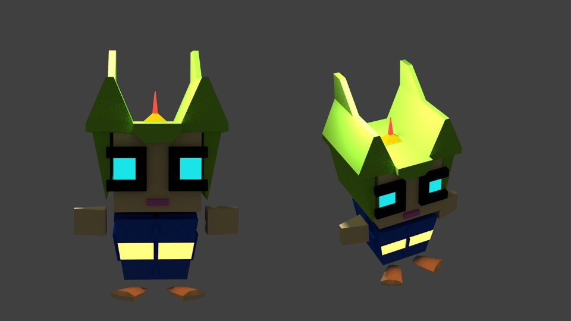

# Save-Avsaka

The game is about a hero who is trying to restore his own planet which has been looted and destroyed by his enemies.
He invades different planets, fights enemies, collect valuable resources and bring back to his planet named as Avsaka to restore as it was before.

__Genre :__ RPG Shooter

__Platforms :__ PC

__Availabe on Windows Store :__ [Avsaka](https://www.microsoft.com/store/apps/9PH3SRPHGC22)

### Tools Used

* Blender3D
* Audacity
* FLStudo
* Illustrator
* Cinema4D
* Unity3D

## Screenshots

### Hero

### Enemies

### Planets

### Game

